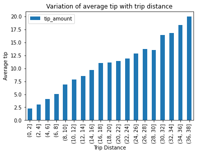
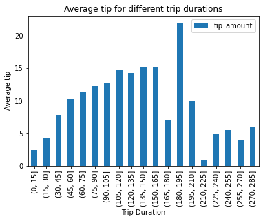
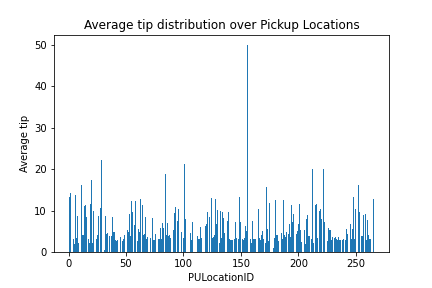
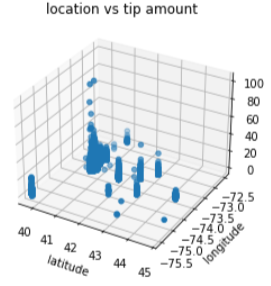

# Taxi-Tip-Prediction

## Introduction

This project aims at creating a model that can predict how much a taxi driver is tipped for a taxi trip, using NYC-TLC Taxi Trip data set.

## Dataset

The New York City - Taxi and Limousine Commission trip records can be found at in the [data and reports](https://www.nyc.gov/site/tlc/about/tlc-trip-record-data.page) section on their website. In this project, the Yellow taxi trip records for the year 2022 were used to train the model. 

<b>Data dictionary - Yellow taxi trip records </b>
| Field name | Description |
| --- | --- |
| VendorID | ID of record provider |
| tpep_pickup_datetime | pickup date and time |
| tpep_dropoff_datetime | drop-off date and time |
| Passenger count | number of passengers in the vehicle |
| Trip Distance | elapsed trip distance in miles |
| PULocationID | Pickup location |
| DOLocationID | Drop-off location |
| RateCodeID | 1= Standard rate   2=JFK   3=Newark   4=Nassau or Westchester   5=Negotiated fare   6=Group ride
| Store_and_fwd_flag | Y = store and forward trip   N = not a store and forward trip |
| Payment_type | 1= Credit card   2= Cash   3= No charge   4= Dispute   5= Unknown   6= Voided trip |
| Fare_amount | fare calculated by the meter |
| Extra | Miscellaneous extras and surcharges |
| MTA_tax | $0.50 MTA tax based on the metered rate |
| Improvement_surcharge | $0.30 improvement surcharge |
| Tip_amount | Amount of tip from passenger |
| Tolls_amount | Amount of all tolls|
| Total_amount | Total amount charged|
| Congestion_Surcharge | amount for congestion surcharge |
| Airport_fee | $1.25 for pick up |

## Exploratory Analysis

Some new features were added as shown in the table below :-

<b> New Features </b>
| Field name | Description |
| --- | --- |
| pickup_hour | Hour of the day at pick up |
| pickup_day | Day of the week at pick up |
| dropoff_hour | Hour of the day at drop off |
| dropoff_day | Day of the week at drop off |
| trip_month | Month of the trip |
| duration | Duration of the trip in minutes (drop-off time - pickup time) |

 
 

Following plots show relationship between some features. For more plots refer to Report.pdf

